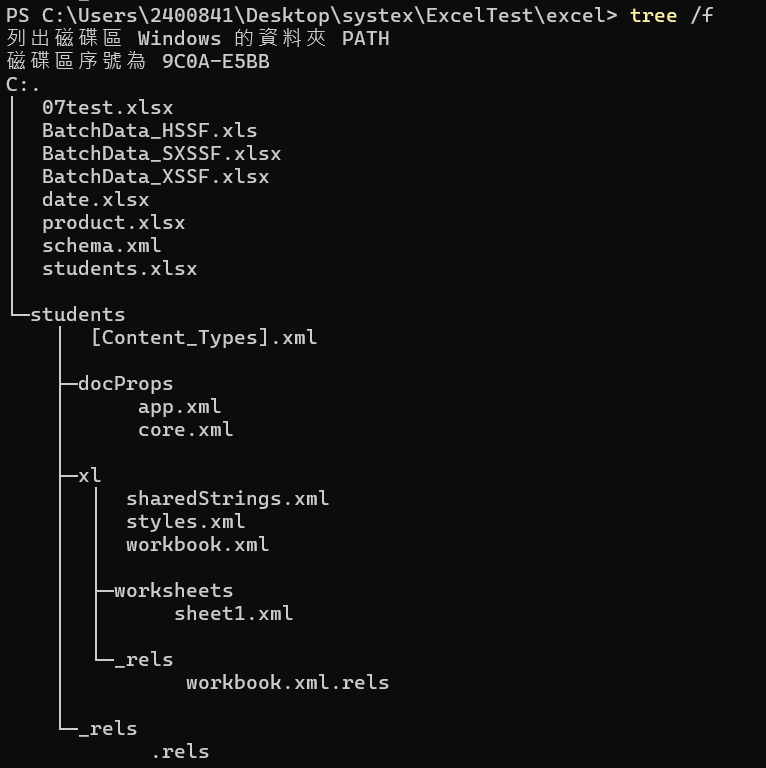

= SAX（Simple API for XML）

== 簡介

SAX 是一種基於事件的 XML 解析 API，專為高效處理大型 XML 檔案而設計。它的事件驅動和逐行讀取特性使其在記憶體效率方面具有明顯優勢，非常適合處理大型數據和即時流式處理的場景。然而，SAX 解析器只能進行前向掃描，無法進行隨機訪問，因此在需要頻繁操作或隨機訪問 XML 節點的應用中，DOM 解析器可能更合適。

== .xlsx檔案分析

以student.xlsx爲例

將副檔名改爲.zip

解壓縮後的資料夾透過**tree /f**指令可以查看結構

* [Content_Types].xml：定義了資料夾中各個 XML 檔案的類型，例如工作表、共享字串等。

* _rels/.rels：包含檔案間的關聯信息，用於描述文檔中各部分的關係。

* docProps：包含文檔屬性（如作者、創建時間等）。

- app.xml 和 core.xml：描述應用程序屬性和文檔的核心屬性。

* xl：包含主要的 Excel 數據部分。
- sharedStrings.xml：保存所有在工作表中使用的字串。

- styles.xml：描述cell樣式的信息。

- workbook.xml：包含工作簿的結構和基本信息，如工作表的名稱和順序。

- worksheets/sheet1.xml：工作表 1 的數據，包含cell信息。

- _rels/workbook.xml.rels：描述工作簿和其他資源之間的關聯。

==  SAX 的主要特點

* 基於事件驅動：SAX 解析 XML 檔案的時候會依次讀取每一行，並在遇到特定標記（例如元素的開始、結束、屬性等）時觸發對應的事件。例如，當讀取到元素的開始標籤時會觸發 startElement() 方法，當遇到結束標籤時會觸發 endElement() 方法。

* 只進行前向讀取：SAX 只會前向讀取 XML 檔案，因此是一種"只讀"模式。它不會將整個文檔加載到記憶體中，因此可以用很少的記憶體來處理大型 XML 檔案。

* 記憶體效率高：由於 SAX 是基於事件的逐行解析，不需要在記憶體中構建整個 XML 樹狀結構，這使得它非常適合處理大數據量的 XML 檔案。

=== 事件驅動

Apache POI 的事件驅動（Event-Driven）模型是一種高效、低記憶體占用的方式來處理 Excel 檔案，特別是 .xlsx 檔案（Office Open XML）。這種方式被稱為 SAX 解析，因為它基於 SAX（Simple API for XML）模型來逐行處理 Excel 檔案中的 XML 結構，而不是將整個檔案加載到記憶體中。因此，事件驅動的模型非常適合用來處理大型 Excel 檔案。

=== SAX 模型的基本工作原理

逐行解析 XML 檔案：SAX 逐行讀取 Excel 中的 XML 結構，當遇到特定的標籤（如 <sheetData>、<row>、<c> 等）時，會觸發相應的事件。
事件處理器：通過定義事件處理器（Handler），對這些事件進行處理，如解析工作表中的行、列、數據等。
記憶體高效：因為它不會將整個檔案加載到記憶體中，只在記憶體中保留當前處理的數據，特別適合用於處理大檔案。

=== 主要的事件驅動類別

在 Apache POI 中，處理 .xlsx 檔案的事件驅動 API 包括以下幾個類別：

* OPCPackage：用來打開 .xlsx 檔案並讀取其內容，這是一個壓縮包格式。
* XSSFReader：用於讀取 Excel 檔案中的各個部分，如工作表、樣式表等。
* ReadOnlySharedStringsTable：用於處理 Excel 檔案中的共享字串，所有字串都存儲在這個表中。
* XMLReader (SAX)：用來逐行解析 XML 檔案，處理工作表中的數據。

== 流

在 SAX（Simple API for XML）解析中，"流" 的概念體現為流式處理 XML 檔案的方式，這與 Java 中的其他流（如 I/O 流或 Stream API）有所不同。SAX 中的流式處理指的是逐行讀取和處理 XML 文檔中的數據，以事件驅動的方式逐步解析，並且只在記憶體中保留當前處理的部分數據，從而達到高效記憶體利用的目的。

[cols="1,1,1", options="header"]
|===
| 特性                   | SAX (事件驅動模型)              | I/O 流                      

| **解析方式**          | 逐行解析 XML 檔案，基於事件驅動處理 | 逐字節或逐字符讀寫，順序處理數據 
| **記憶體使用**          | 低，僅保留當前解析部分，記憶體占用小 | 低，逐步讀取或寫入，不需要全部加載 
| **訪問方式**          | 順序訪問，無法隨機訪問已處理部分   | 順序訪問，逐字節或逐字符處理數據 
| **適合場景**          | 大型 XML 檔案的逐行掃描和解析    | 檔案、網絡、記憶體的讀取和寫入           
| **操作靈活性**        | 靈活性較低，只能在遇到事件時進行處理 | 靈活性較高，可以讀取、寫入和跳過數據 
| **使用的 Java 類**     | `XMLReader`，`ContentHandler`   | `InputStream`，`OutputStream`，`Reader`，`Writer` 
|===

== 使用事件驅動 API 的步驟

[source,java]
----
public void readExcel(String filePath) throws Exception {
    long start = System.currentTimeMillis();
    try (OPCPackage opcPackage = OPCPackage.open(new FileInputStream(filePath))) {
        ReadOnlySharedStringsTable strings = new ReadOnlySharedStringsTable(opcPackage);
        XSSFReader xssfReader = new XSSFReader(opcPackage);
        StylesTable styles = xssfReader.getStylesTable();

        XSSFReader.SheetIterator iter = (XSSFReader.SheetIterator) xssfReader.getSheetsData();
        while (iter.hasNext()) {
            try (InputStream stream = iter.next()) {
                String sheetName = iter.getSheetName();
                System.out.println("Sheet Name: " + sheetName);
                processSheet(styles, strings, stream);
            }
        }
    }
    long end = System.currentTimeMillis();
    System.out.println((end - start) + "ms");
}
----

* OPCPackage opcPackage：OPCPackage 用於打開 .xlsx 檔案，OPC 是 Open Packaging Conventions 的縮寫，它是 .xlsx 檔案的核心包裝方式。

* ReadOnlySharedStringsTable strings：ReadOnlySharedStringsTable 用於存取共享字串表，Excel 中的所有字串被存儲在這個表中，這樣可以減少重複數據，節省空間。

* XSSFReader xssfReader：XSSFReader 用於從 .xlsx 檔案中讀取不同部分，例如工作表、樣式表等。

* StylesTable styles：讀取 Excel 檔案中的樣式信息。

* XSSFReader.SheetIterator iter：SheetIterator 用於遍歷 Excel 檔案中的所有工作表。

對於每個工作表，調用 processSheet() 方法來進行處理。

image::./images/OPCPackage,open.png[]

* OPCPackage：OPCPackage 是代表 Office Open XML 包裝格式的核心類，它用於處理 .xlsx、.docx 等檔案。
* new ZipPackage(in, PackageAccess.READ_WRITE)：創建一個ZipPackage，這是一個 OPCPackage 的子類，專門用來處理壓縮包格式（如 .xlsx 這種基於 ZIP 的檔案格式）。它的參數包括：
- InputStream in：輸入的數據流，通常是 Excel 檔案的二進制數據。
- PackageAccess.READ_WRITE：指定訪問模式，這裡是讀寫模式，可以讀取和修改包中的內容。
* if (pack.partList == null)：partList 是包中的各個部分（Part）的列表。如果 partList 為 null，表示該包還沒有加載其內容，因此需要加載它。

* pack.getParts()：調用 getParts() 方法來加載 .xlsx 檔案中的所有部分。這些部分包括工作表（sheet）、共享字串（sharedStrings）、樣式（styles）等 XML 檔案。

* catch (InvalidFormatException | RuntimeException e)：

- 捕獲可能拋出的異常，其中包括 InvalidFormatException 和 RuntimeException。
- IOUtils.closeQuietly(pack)：這一行代碼用於在發生異常時關閉打開的 OPCPackage，以確保資源被正確釋放。closeQuietly 會悄無聲息地關閉資源，即使發生錯誤也不會影響後續代碼。
- throw e：在捕獲異常後，重新將異常拋出，使得調用者知道發生了什麼問題。

[source,java]
----
private void processSheet(StylesTable styles, ReadOnlySharedStringsTable strings, InputStream sheetInputStream)
        throws ParserConfigurationException, SAXException, IOException {
    InputSource sheetSource = new InputSource(sheetInputStream);
    org.xml.sax.XMLReader sheetParser = org.xml.sax.helpers.XMLReaderFactory.createXMLReader();
    ContentHandler handler = new ContentHandler(styles, strings);
    sheetParser.setContentHandler(handler);
    sheetParser.parse(sheetSource);
}
----
* InputSource sheetSource：InputSource 包裝了工作表的輸入流。
* XMLReader sheetParser：是基於 SAX 的 XML 解析器，它是**流式**的，逐行處理 XML 檔案，並且只在記憶體中保留當前正在處理的部分。
* ContentHandler handler：自定義的事件處理器，用於處理 XML 中的不同標籤。
* 設置事件處理器後，調用 parse() 方法來解析工作表。

[source,java]
----
private static class ContentHandler extends DefaultHandler {
    private final StylesTable stylesTable;
    private final ReadOnlySharedStringsTable sharedStringsTable;
    private String cellValue;
    private boolean isString;
    private int rowNum;

    public ContentHandler(StylesTable styles, ReadOnlySharedStringsTable strings) {
        this.stylesTable = styles;
        this.sharedStringsTable = strings;
    }

    @Override
    public void startElement(String uri, String localName, String name, Attributes attributes) throws SAXException {
        if (name.equals("row")) {
            rowNum = Integer.parseInt(attributes.getValue("r")); // 讀取行號
        } else if (name.equals("c")) { // cell標籤
            String cellType = attributes.getValue("t");
            isString = (cellType != null && cellType.equals("s")); // 判斷cell是否是共享字串類型
        }
        cellValue = ""; // 重置cell值
    }

    @Override
    public void characters(char[] ch, int start, int length) throws SAXException {
        cellValue += new String(ch, start, length); // 收集文本內容
    }

    @Override
    public void endElement(String uri, String localName, String name) throws SAXException {
        if (name.equals("v")) { // 當標籤結束為 <v> 時，即cell的值
            if (isString) {
                int idx = Integer.parseInt(cellValue);
                cellValue = new XSSFRichTextString(sharedStringsTable.getEntryAt(idx)).toString(); // 轉換共享字串為實際值
            }
            System.out.print(cellValue + "\t"); // printcell值
        } else if (name.equals("row")) {
            System.out.println(); // 行結束，換行
        }
    }
}
----
這個類負責處理 XML 的每個標籤，根據標籤的不同執行不同的操作。

* 成員變量：
- StylesTable stylesTable：存儲 Excel 的樣式信息，但在這裡未使用。
- ReadOnlySharedStringsTable sharedStringsTable：共享字串表，用於存儲 Excel 中所有的字串。
- cellValue：用於保存當前cell的值。
- isString：標記當前cell是否是共享字串類型。

* startElement() 方法：
- 當 SAX 解析器讀到一個 XML 開始標籤時（如 <row> 或 <c>），它會觸發 startElement() 事件。這是一種流式的處理，逐行讀取、逐行判斷，每次只處理當前的部分。
- 當遇到 <row> 標籤時，讀取行號。
- 當遇到 <c> 標籤時，根據屬性 t 判斷該cell是否為共享字串。
- 重置 cellValue，以便開始讀取新的cell值。

* characters() 方法：

- 收集當前標籤中的文本內容，可能是一個部分，因為 SAX 解析是逐塊進行的。
- 當讀取到標籤之間的文本內容時，會觸發 characters() 事件，這種方式允許**逐塊**處理文本。
- 每當讀到文本片段時，就將它附加到 cellValue 中，這也是**逐行、逐部分**地處理數據的一種體現。

* endElement() 方法：

- 當讀到標籤的結束標誌時，會觸發 endElement() 事件，這是一種典型的**流式**處理方式，因為它只在需要時處理結束的元素，不會保留整個 XML 樹。例如，當標籤結束為 <v> 時（代表cell的值結束），程序處理當前cell的值並將其print出來。

- 當遇到 </v> 標籤（表示cell的值結束）時，如果是共享字串，則從共享字串表中獲取實際值。
- 當遇到 </row> 標籤時，表示行結束，換行輸出。

|===
| 特性                   | XSSFWorkbook (DOM 模型)          | SAX (事件驅動模型)           

| **解析方式**          | 將整個檔案加載到記憶體中，構建完整的樹狀結構 | 逐行解析 XML 檔案，基於事件驅動處理 |
 **記憶體使用**          | 高，占用記憶體大，特別是處理大型檔案時可能導致 OutOfMemoryError | 低，僅保留當前解析部分，記憶體占用小 |
 **訪問方式**          | 支持隨機訪問，可以隨時訪問和修改任意節點 | 僅支持順序訪問，無法隨機訪問已經處理的部分 |
 **適合場景**          | 適合處理小型檔案或需要頻繁隨機訪問和修改數據的場景 | 適合處理大型檔案，批量導入/導出和逐行掃描數據 |
 **實現難度**          | 簡單，操作直觀，代碼量少           | 較複雜，需要編寫事件處理器來逐行解析和處理 XML 標籤 |
 **性能**              | 對於小檔案性能良好，但大檔案會因記憶體問題影響性能 | 對於大型檔案性能更優，能高效處理大數據量 |
 **操作靈活性**        | 高，支持對文檔的各種操作，如增、刪、改、查 | 靈活性較低，只能在遇到事件時進行相應處理 |
 **使用的 Apache POI 類** | `XSSFWorkbook`                  | `XSSFReader`，`XMLReader`，`ContentHandler` |
 **加載速度**          | 慢，需要將整個檔案加載到記憶體中     | 快，只需逐行讀取，適合快速掃描大檔案 |
 **錯誤處理**          | 容易發現和修復，由於整個文檔在記憶體中，可以方便地進行錯誤排查 | 較難，需要處理異常情況並確保解析過程不會中斷 |
 **檔案修改能力**      | 支持完整的檔案修改，包括添加、刪除和更新 | 不支持修改，只適合讀取操作 |
 **記憶體效率**          | 低，特別是對於大型檔案，容易導致記憶體不足 | 高，記憶體佔用小，適合處理超大檔案 |
 **學習曲線**          | 平緩，API 使用簡單，類似於操作集合 | 陡峭，需要熟悉事件驅動模型和 XML 標籤的處理 |

